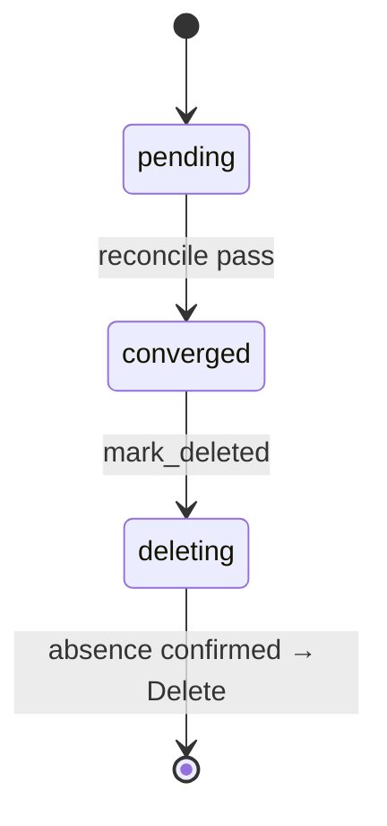

# order flows

## `order` lifecycle

TODO: the state machine of this type — the phases in `status`, what moves
each transition, what the reconcile pass checks level by level, how
teardown confirms absence (the Directive §3 invariant 6).

## `shipment` lifecycle

TODO: the state machine of this type — the phases in `status`, what moves
each transition, what the reconcile pass checks level by level, how
teardown confirms absence (the Directive §3 invariant 6).

## Edge cases

| # | Trigger | Code path | Behaviour |
|---|---|---|---|
| 1 | TODO | | |
