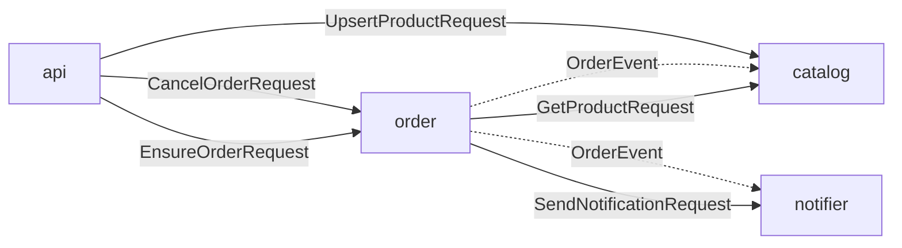

## Message topology

Generated from `routing.yaml` by `basable-messenger-gen docs`; the router is `AppMessenger`.

| Nanoservice | Handles | Sends |
|---|---|---|
| `catalog` | `UpsertProductRequest` → `Product`, `GetProductRequest` → `Product`, `OrderEvent` | — |
| `order` | `EnsureOrderRequest` → `Order`, `CancelOrderRequest` → `Order` | `GetProductRequest` → `Product`, `SendNotificationRequest` → `NotificationReceipt`, `OrderEvent` |
| `notifier` | `SendNotificationRequest` → `NotificationReceipt`, `OrderEvent` | — |
| `api` (sends-only) | — | `UpsertProductRequest` → `Product`, `EnsureOrderRequest` → `Order`, `CancelOrderRequest` → `Order` |

| Message | Response | Shape | Handlers | Senders |
|---|---|---|---|---|
| `UpsertProductRequest` | `Product` | 1:1 request | `catalog` | `api` |
| `GetProductRequest` | `Product` | 1:1 request | `catalog` | `order` |
| `OrderEvent` | — | void fan-out | `catalog`, `notifier` | `order` |
| `EnsureOrderRequest` | `Order` | 1:1 request | `order` | `api` |
| `CancelOrderRequest` | `Order` | 1:1 request | `order` | `api` |
| `SendNotificationRequest` | `NotificationReceipt` | 1:1 request | `notifier` | `order` |

